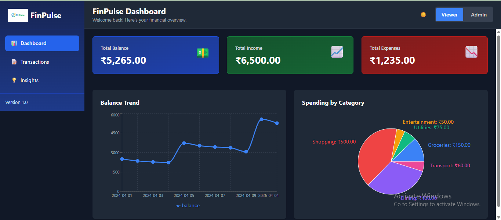
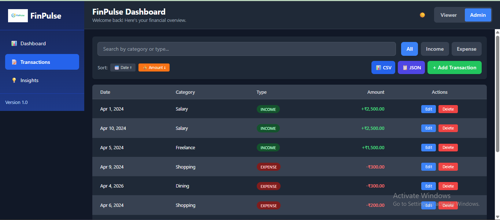
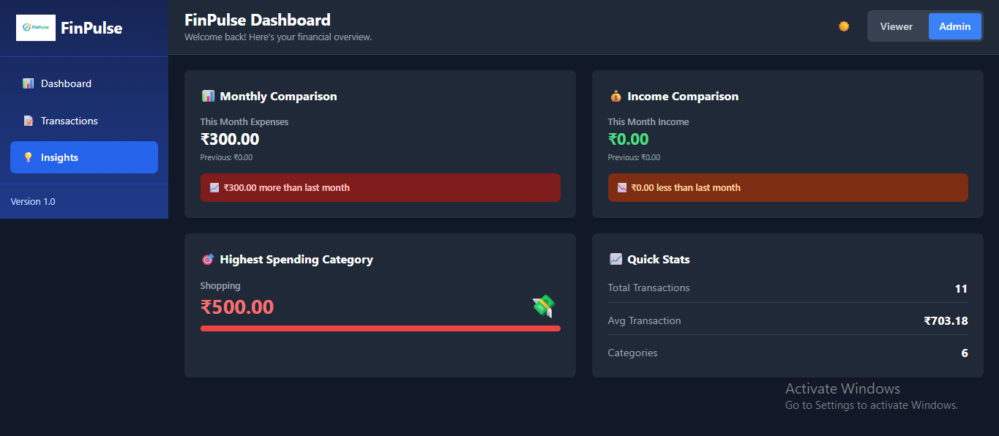
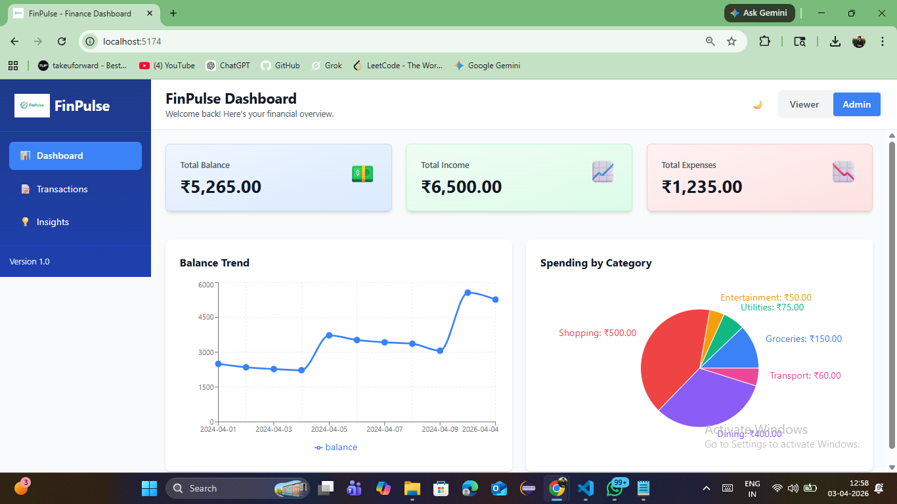

# 💰 FinPulse Dashboard

A modern, fully-featured financial dashboard built with React and Tailwind CSS. This project demonstrates clean UI design, efficient state management, and excellent user experience for personal finance tracking and analysis.

---

## 🎯 Overview

The FinPulse Dashboard is a comprehensive financial management tool that allows users to track income and expenses, analyze spending patterns, and gain insights into their financial health. Built with a focus on user experience, the dashboard features a clean interface, smooth interactions, and intelligent data visualization.

**Key Highlights:**
- ✅ Fully responsive design (mobile, tablet, desktop)
- ✅ Dark mode with persistent preferences
- ✅ Role-based access control (Viewer/Admin)
- ✅ Real-time data filtering, sorting, and search
- ✅ Dynamic financial charts and visualizations
- ✅ Modal-based transaction management
- ✅ Professional currency formatting (INR)
- ✅ Production-ready code quality

---

## 🛠 Tech Stack

| Technology | Purpose |
|-----------|---------|
| **React 19.2.4** | UI framework with modern hooks |
| **Vite** | Lightning-fast build tool |
| **Tailwind CSS 3** | Utility-first CSS for styling |
| **React Router DOM v6** | Client-side routing |
| **Recharts 2** | Interactive charts & visualizations |
| **Context API** | Global state management |
| **localStorage** | Client-side data persistence |

---
## 📸 Screenshots

### 📊 Dashboard


### 💳 Transactions


### 💡 Insights


### 🌙 Light Mode


## ✨ Features Implemented

### 📊 Dashboard Overview
- **Summary Cards**: Quick view of total balance, income, and expenses with hover animations
- **Balance Trend Chart**: Line chart showing financial balance progression over time
- **Spending by Category**: Pie chart with INR currency labels for expense breakdown
- **Smart Data Visualization**: Dynamic colors based on dark mode for optimal visibility

### 💳 Transactions Management
- **View Transactions**: Complete table with date, category, type, and amount
- **Search Functionality**: Real-time search by category or transaction type
- **Filter Options**: Quick filters for All/Income/Expense transactions
- **Sorting Capabilities**: Sort by date (newest/oldest) or amount (high/low)
- **CRUD Operations** (Admin only):
  - Add new transactions via modal
  - Edit existing transactions
  - Delete transactions with confirmation
- **Currency Display**: All amounts formatted in INR (₹)

### 🔐 Role-Based Access Control
- **Viewer Role**: Read-only access to all financial data
- **Admin Role**: Full transaction management capabilities
- **Role Switcher**: Seamless role switching via Topbar dropdown
- **Smart UI**: Components adapt based on user role

### 💡 Insights Section
- **Monthly Comparison**: Compare current vs. previous month expenses and income
- **Highest Spending Category**: Identify top spending categories with visual progress bars
- **Financial Statistics**: Total transactions, average transaction amount, category count
- **Trend Indicators**: Visual indicators (📈/📉) showing spending trends

### 🌓 Dark Mode
- **Toggle Button**: Easy dark/light mode switching in the Topbar
- **Persistent Preference**: User's theme choice saved to localStorage
- **Complete Support**: Dark mode styling across all components
- **Smooth Transitions**: Elegant color transitions between themes
- **Accessibility**: Proper contrast ratios in both modes

### 🎨 User Experience Enhancements
- **Loading States**: Professional loading screen on app initialization
- **Empty States**: Helpful messages for empty transactions and no-data scenarios
- **Modal Forms**: Clean modal popup for adding/editing transactions
- **Animations**: Smooth hover effects and scale transitions on cards and buttons
- **Responsive Design**: Fully functional on mobile, tablet, and desktop
- **Navigation**: Sidebar on desktop, mobile nav on smaller screens
- **Feedback**: Smooth transitions, hover effects, and color feedback

---

## 📁 Project Structure

```
finance-dashboard/
├── src/
│   ├── components/          # Reusable UI components
│   │   ├── Sidebar.jsx      # Navigation sidebar
│   │   ├── Topbar.jsx       # Header with theme and role controls
│   │   ├── SummaryCards.jsx # Summary cards with animations
│   │   ├── ChartsSection.jsx # Line & pie charts with data visualization
│   │   ├── TransactionsTable.jsx # Transaction management with modal
│   │   ├── InsightsPanel.jsx # Financial insights & analytics
│   │   └── Modal.jsx        # Reusable modal component
│   │
│   ├── pages/               # Page components
│   │   ├── DashboardPage.jsx    # Main overview page
│   │   ├── TransactionsPage.jsx # Transaction management page
│   │   └── InsightsPage.jsx     # Analytics & insights page
│   │
│   ├── context/             # State management
│   │   └── FinanceContext.jsx   # Global state with reducers
│   │
│   ├── utils/               # Utility functions
│   │   └── currencyFormat.js    # INR currency formatting
│   │
│   ├── data/                # Mock data
│   │   └── index.js         # Sample transactions database
│   │
│   ├── App.jsx              # Main app component & routing
│   ├── main.jsx             # App entry point
│   ├── index.css            # Global styles
│   └── App.css              # App component styles
│
├── public/                  # Static assets
├── package.json             # Dependencies
├── vite.config.js           # Vite configuration
├── tailwind.config.js       # Tailwind CSS configuration
├── eslint.config.js         # ESLint configuration
└── README.md               # Project documentation
```

---

## 🚀 Getting Started

### Prerequisites
- Node.js (v16+)
- npm or yarn

### Installation

1. **Clone the repository**
   ```bash
   git clone https://github.com/yourusername/finance-dashboard.git
   cd finance-dashboard
   ```

2. **Install dependencies**
   ```bash
   npm install
   ```

3. **Start the development server**
   ```bash
   npm run dev
   ```
   The app will run on `http://localhost:5173`

### Build for Production
```bash
npm run build
```
Build output will be in the `dist/` folder.

### Preview Production Build
```bash
npm run preview
```

---

## 💾 Data Persistence

The dashboard uses **localStorage** to persist:
- ✅ All transactions (add, edit, delete)
- ✅ User role preference (Viewer/Admin)
- ✅ Dark mode preference
- ✅ Search and filter states

**Simulation Data**: Mock transactions are pre-loaded on first use. All edits are saved locally and persist across sessions.

---

## 🎓 Key Design Decisions

### 1. **Context API for State Management**
Instead of Redux or Zustand, we chose Context API because:
- Minimal boilerplate for this project scale
- Built into React (no external dependency)
- Clear data flow without prop drilling
- Easy to understand and maintain
- Sufficient for non-enterprise use cases

### 2. **Mock Data Instead of Backend**
The project uses simulated transaction data because:
- Focuses on UI/UX without API complexity
- Demonstrates frontend capabilities independently
- localStorage simulates persistence
- Can be easily replaced with real API endpoints

### 3. **Tailwind CSS for Styling**
We selected Tailwind CSS because:
- Rapid development with utility classes
- Consistent design system out-of-the-box
- Easy dark mode implementation
- Highly customizable
- Smaller final bundle size

### 4. **React Router for Navigation**
Client-side routing provides:
- Fast navigation without page reloads
- Clean URL handling
- Component-based route management
- State preservation during navigation

### 5. **Recharts for Visualizations**
We chose Recharts because:
- Simple React integration
- Responsive out-of-the-box
- Beautiful default styling
- Customizable components

---

## 🎯 User Flows

### Viewer Role
```
Login → Dashboard (Read-only)
         ├── View Summary Cards
         ├── Analyze Charts
         ├── Browse Transactions (Search/Filter)
         └── Check Insights
```

### Admin Role
```
Login → Dashboard (Full Access)
        ├── All Viewer features
        ├── Add New Transaction (Modal)
        ├── Edit Transaction
        ├── Delete Transaction
        └── Full Control
```

---

## 🌐 Responsive Design

The dashboard is fully responsive across devices:

| Device | Features |
|--------|----------|
| **Mobile** | Stacked layout, Mobile bottom nav, Touch-friendly buttons |
| **Tablet** | 2-column grid, Sidebar partial, Optimized spacing |
| **Desktop** | Full sidebar, Multi-column layouts, Hover effects |

---

## 🔄 Component Communication

The app uses a **Context + Hooks** pattern for clean component communication:

```
FinanceProvider (Context)
    ├── darkMode, toggleDarkMode
    ├── transactions, addTransaction, editTransaction, deleteTransaction
    ├── role, updateRole
    ├── searchTerm, setSearchTerm
    ├── filterType, setFilterType
    ├── sortBy, setSortBy
    ├── isLoading
    └── getFilteredTransactions()
```

All components consume this context via `useFinance()` hook with **zero prop drilling**.

---

## 📈 Performance Optimizations

- ✅ Code splitting via React Router
- ✅ Lazy loading for routes
- ✅ Memoized callbacks in Context
- ✅ Optimized re-renders with useCallback
- ✅ Efficient array filtering and sorting
- ✅ CSS optimization via Tailwind purging

---

## 🐛 Error Handling

- Form validation with user feedback
- Confirmation dialogs for destructive actions
- Empty state messages for edge cases
- Loading states during data processing
- Try-catch blocks for critical operations

---

## 🚢 Deployment

### Deploy on Vercel (Recommended)

1. Push your code to GitHub
2. Connect your repository to Vercel
3. Vercel automatically detects Vite configuration
4. Deploy with one click!

```bash
npm install -g vercel
vercel
```

### Deploy on Netlify

```bash
npm run build
# Deploy the 'dist' folder to Netlify
```

### Deploy on GitHub Pages

```bash
npm run build
# Push 'dist' folder contents to gh-pages branch
```

---

## 🎨 Customization

### Modify Theme Colors
Edit `tailwind.config.js` to customize colors:
```javascript
theme: {
  extend: {
    colors: {
      'primary': '#3B82F6',
      'secondary': '#10B981',
    }
  }
}
```

### Update Currency Format
Edit `src/utils/currencyFormat.js`:
```javascript
export const formatCurrency = (amount) => {
  return new Intl.NumberFormat('en-IN', { // Change locale here
    style: 'currency',
    currency: 'INR', // Change currency code
  }).format(amount)
}
```

---

## 🔐 Data Privacy

- All data is stored locally in the browser (localStorage)
- No data is sent to external servers
- No tracking or analytics
- Clearing browser data will reset the app

---

## 📝 Code Quality

- ESLint configured for best practices
- Consistent code formatting
- Component modularity and reusability
- Clear naming conventions
- Comprehensive comments where needed

---

## 🤝 Contributing

This is a portfolio project. Suggestions and feedback are welcome!

---

## 📧 Contact & Support

For questions or feedback about this project:
- 📧 Email: salunkhepranay14@gmail.com
- 🐙 GitHub: [Pranay98600-coder](https://github.com/Pranay98600-coder)
- 💼 LinkedIn: [PRANAY SALUNKHE](https://www.linkedin.com/in/pranay-salunkhe-968650255/)

---

## 📄 License

This project is open source and available under the MIT License.

---

## 🙏 Acknowledgments

- Inspired by modern financial dashboards
- Built with React community best practices
- UI icons and emojis for visual appeal

---

**Made with ❤️ as a React learning project | Last Updated: April 2026**
